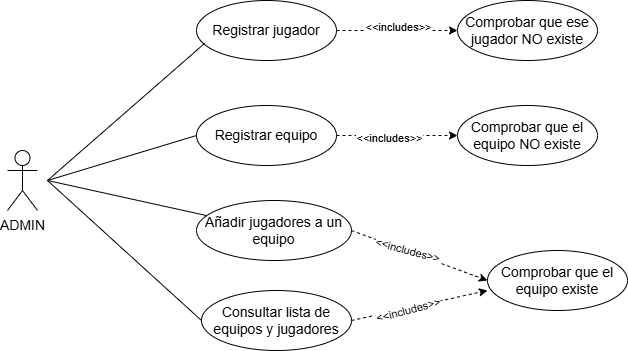
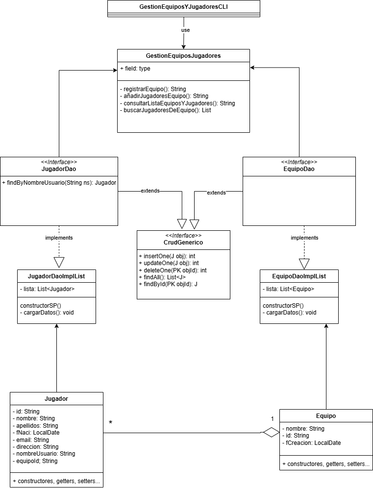

# Sistema de Gestión de Torneos de eSports 
## Autor
Cristina Salazar Guijarro
KrissBlueMeth

## Descripción del Proyecto
(https://github.com/KrissBlueMeth/TORNEO-SPORTS-UML.git)

Este proyecto implementa un sistema de gestión de torneos de Sports utilizando UML para el modelado y Java para la implementación. Forma parte de la actividad evaluable del tercer trimestre de la asignatura de Entornos de Desarrollo y he utilizado draw.io para realizar el diagrama de casos de uso y el de clases. Además he creado el proyecto en Java para poder comprobar si funcionaría correctamente. 

## Diagramas UML 

### Diagrama de Casos de Uso 
 

### Diagrama de Clases 
 

## Estructura del Proyecto

```tree
TORNEO-ESPORTS-UML/
├── ENTORNOS_APP/
│   ├── .settings/
│   ├── bin/
│   ├── src/
│   │   ├── (default package)/
│   │   │   └── Main.java
│   │   ├── control/
│   │   │   └── GestionEquiposYJugadores.java
│   │   ├── entidades/
│   │   │   ├── Equipo.java
│   │   │   └── Jugador.java
│   │   ├── negocio/
│   │   │   ├── CrudGenerico.java
│   │   │   ├── EquipoDao.java
│   │   │   ├── EquipoDaoImplList.java
│   │   │   ├── JugadorDao.java
│   │   │   └── JugadorDaoImplList.java
│   │   ├── test/
│   │   │   └── MainTest.java
│   │   └── vista/
│   │       └── GestionEquiposYJugadoreCli.java
│   ├── .classpath
│   ├── .project
├── diagrams/
│   ├── EEDD_CASOS_USP.png
│   ├── EEDD_DIAGRAMA_CLASES.png
├── README.md
├── AD3_UML_ENUNCIADO.pdf
```

## Instalación y Ejecución 
1. Clonar el repositorio:
 `git clone https://github.com/KrissBlueMeth/TORNEO-ESPORTS-UML.git´
  
2. Importar el proyecto en Eclipse:
   
Abre Eclipse.

Ve a File > Import....

Selecciona General > Existing Projects into Workspace y haz clic en Next.

En Select root directory, navega hasta la carpeta TORNEO-ESPORTS-UML/ENTORNOS_APP.

Asegúrate de que el proyecto esté seleccionado en la lista y haz clic en Finish.

3. Ejecutar la aplicación:
   
En el Package Explorer de Eclipse, abre el archivo Main.java (ubicado en el default package dentro de src).

Haz clic derecho sobre Main.java y selecciona Run As > Java Application.

 ## Justificación del diseño 
 Un ADMIN accede a los casos de uso. Los casos de uso "Registrar equipo", "Añadir jugadores a un equipo" y "consultar lista de equipos y jugadores" los he contemplado como casos de usos independientes (se pueden utilizar de manera independiente, por ejemplo: puedo crear un equipo sin necesidad de añadir ningún jugador en ese momento al equipo. O puedo añadir jugadores sin meterlos obligatoriamente dentro de un equipo). Registrar equipo incluye comprobar que el equipo NO exista ya. Y añadir jugadores a un equipo y consultar la lista de equipos y jugadores, incluyen comprobar que el equipo existe previamente, ya que si no existiera, no se podrían añadir los jugadores ni consultar la lista. He añadido un nuevo caso de uso: "Registrar Jugador" ya que me parecía importante para el correcto funcionamiento del proyecto, que incluye comprobar que ese jugador no exista previamente. (Para evitar que un mismo jugador se registre 2 veces)
En cuanto a las clases, serían 2: equipo y jugador. Las interfaces son "JugadorDAo" y "EquipoDAo", que extienden de la interface "CrudGenerico". "jugadorDaoImplList" implementa a "JugadorDao" y "EquipoDAoImplList" implementa de "EquipoDao" La gestión de la app se hará con "GestionEquiposJugadores" y "GestionEquiposYJugadoresCLI" es la vista que permite que el usuario pueda interaccionar con la app.
 
 ## Conclusiones Sobre el aprendizaje obtenido.
Lo que destaco es que, para realizar el UML correctamente hay que preguntarse "¿qué queremos hacer?" y ¿"cómo lo queremos hacer?" en cada paso, ya que en función de lo que queramos, se puede interpretar de una manera o de otra. Al principio puede resultar confuso debido a estas interpretaciones, por eso es bueno ir paso a paso concretando cada punto, con el objetivo de que la aplicación se comporte exactamente como necesitamos que lo haga. 
